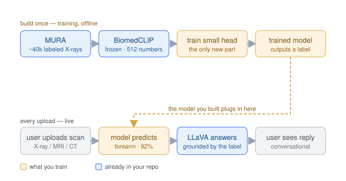
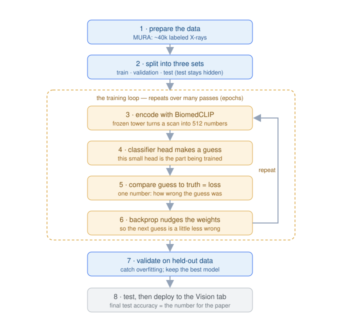

# Vision tab — training the bone-image classifier

Full documentation of the Vision tab's *trained* component: motivation, design,
data, method, compute, and results. Written to be self-contained for the
methods section of the paper.

> Status: feature cache + head-training pipeline built on `feature/vision-training`.
> Results section is filled from the first MURA run (see [Results](#results)).

---

## 1. Motivation

The Vision tab originally shipped a bare vision-language model (`llava:13b` via
Ollama) with a system prompt and a correction-memory layer — the VLM identified
an uploaded bone image from its general pre-training alone, with no component
trained on bone data. The supervisor review (2 July 2026) judged this
insufficient: a general VLM "dropped in" is not, by itself, a defensible
research contribution. The Vision tab needs a component **trained on real bone
images**, mirroring how the Reasoning tab is grounded in a curated corpus.

This document covers that trained component: a compact classifier learned from
the MURA musculoskeletal radiograph dataset on top of frozen BiomedCLIP image
features.

## 2. Design — the hybrid

Rather than replace the VLM, the trained classifier **grounds** it. A small head
predicts a bone label from the image; that prediction is injected into the VLM's
prompt so the conversational answer is anchored to a model trained on bone data
instead of the VLM guessing unaided.



- **Build once (offline):** every MURA image → frozen BiomedCLIP → a 512-d
  vector; a small head is trained to map those vectors to a bone label.
- **Every upload (live):** the trained head predicts a label (e.g. *forearm,
  92%*), which is added to the VLM prompt; `llava:13b` then answers
  conversationally, grounded by that label. The existing correction memory still
  contributes recalled 👎 corrections through the same "inject into the prompt"
  mechanism.

Only the amber components are new; BiomedCLIP and `llava:13b` are already in the
system.

### Why this approach (and not the alternatives)

- **Not training from scratch.** A randomly-initialised model needs millions of
  images and heavy compute to learn basic vision; ~40k images would overfit.
  Every sensible approach starts from a pre-trained model.
- **Not fine-tuning LLaVA (for the MVP).** Fine-tuning a 13B multimodal model
  needs a large GPU (24–48 GB), a bespoke image→answer instruction dataset, and
  is hard to evaluate quantitatively. It is deferred to the university GPU
  server as a later experiment.
- **Linear probe / small head on BiomedCLIP (chosen).** BiomedCLIP is already
  medical-domain pre-trained and already used by the Vision tab's correction
  memory. Freezing it and training only a small head is fast (minutes once
  features are cached), yields a clean accuracy metric, and is genuinely "a model
  trained on bone data". It is also a cheap early signal: if a probe cannot
  separate the classes, full fine-tuning will not either.

## 3. Data — MURA

[MURA](https://stanfordmlgroup.github.io/competitions/mura/) (Stanford ML Group)
is a large dataset of upper-extremity musculoskeletal radiographs.

| Property | Value |
|---|---|
| Images (train / valid) | 36,808 / 3,197 |
| Patients (train / valid) | 11,184 / 783 |
| Body regions | 7 (elbow, finger, forearm, hand, humerus, shoulder, wrist) |
| Study-level label | normal (`negative`) / abnormal (`positive`) |
| Modality | X-ray only (upper limb) |

Per-region training image counts (note the imbalance — wrist ≈ 8× humerus):

| region | images |
|---|---|
| wrist | 9,752 |
| shoulder | 8,379 |
| hand | 5,543 |
| finger | 5,106 |
| elbow | 4,931 |
| forearm | 1,825 |
| humerus | 1,272 |

**Labels are derived from the file path** (`XR_<REGION>/patient<NNNNN>/study<N>_<label>/`)
— no manual annotation. **Splits are patient-disjoint:** MURA's official
train/valid never share a patient, and the monitoring-validation slice carved out
of train (10%) is split by *patient*, not by image, to prevent leakage.

**Coverage gap (important for the paper's scope):** MURA is upper-limb X-ray
only. No spine, hip/pelvis, lower limb, MRI, CT, or micro-CT. Extending coverage
is future work (§7).

## 4. Method



- **Encoder:** `microsoft/BiomedCLIP-PubMedBERT_256-vit_base_patch16_224` — a
  ViT-B/16 image tower pre-trained on PubMed figure–caption pairs. 512-d
  L2-normalised image embeddings. **Frozen** (not updated during training).
- **Head:** a linear classifier `Linear(512 → n_classes)` by default; optionally
  a one-hidden-layer MLP (`--hidden`, ReLU + dropout 0.2).
- **Task:** 7-way body-region classification (`--target region`). Binary
  normal/abnormal is available (`--target abnormal`) but is framing only — the
  Vision tab is **not** a diagnostic tool.
- **Loss / optimiser:** cross-entropy with **inverse-frequency class weights**
  (so rare regions such as humerus are not ignored); Adam, weight decay 1e-4.
- **Model selection:** trained for N epochs; the checkpoint with the best
  patient-held-out validation accuracy is kept.
- **Evaluation:** final accuracy is reported on MURA's official **valid** split,
  which the model never sees during training. Metrics: overall accuracy,
  per-region accuracy, and macro-F1.

## 5. Compute environment

The feature cache was run on the deployment box — an **NVIDIA Jetson AGX Orin
(64 GB)** — because feature extraction is *inference*, which the Jetson handles
well.

- The Jetson's PyTorch is **CPU-only** (no CUDA toolkit/cuDNN installed for it,
  and the app venv is Python 3.13, for which no NVIDIA Jetson CUDA wheel exists).
  Installing CUDA there was judged not worth the risk/effort for this run.
- Measured throughput: **~3.4 images/s** on CPU → full 40k-image cache in
  **~3 hours**. Feature extraction ran alongside the live site without disruption
  (the site's inference is GPU/Ollama; the cache used CPU cores).
- Head training itself is seconds (it operates on cached vectors).
- For faster iteration / full LLaVA fine-tuning, the university GPU server is the
  intended box.

## 6. Reproducibility

Code lives in [`vision/training/`](../../vision/training/):

| File | Role |
|---|---|
| `mura_dataset.py` | parse MURA paths → records; patient-disjoint splits |
| `cache_features.py` | resumable, batched BiomedCLIP feature extraction (`--limit` for a smoke run) |
| `train_head.py` | train the head; report per-region accuracy; save the model |
| `vision/encoder.py` | `embed_batch()` — bulk BiomedCLIP encoding |

```bash
# 1. cache features (GPU-friendly; resumable)
python -m vision.training.cache_features --split all
# 2. train + evaluate the head (seconds)
python -m vision.training.train_head --target region
```

Outputs: `data/db/vision_features/features_{train,valid}.npz` (cached vectors),
`data/models/vision_region_head.pt` + `.json` (trained head + metrics). See
[`vision/training/README.md`](../../vision/training/README.md) for the Jetson run
guide (transfer, aarch64 env workarounds).

## 7. Future work

- **Fill coverage gaps by merging labeled datasets** (deliberately, with a
  consistent label scheme — most likely *modality + region*, since X-ray/CT/MRI
  of the same bone differ visually). Candidates: TotalSegmentator / VerSe /
  CTPelvic1K (CT, many bones + spine + pelvis), VinDr-SpineXR (spine X-ray),
  RSNA Pediatric Bone Age (hand X-ray), MRNet / OAI (knee MRI). Report baseline
  (MURA-only) vs augmented accuracy.
- **Full LLaVA fine-tuning** on the university GPU server as a separate
  experiment, with the un-tuned model as the documented baseline.
- ~~Wire the trained head into the live `/api/vision/chat` as prompt grounding~~
  **Done** — [`vision/classifier.py`](../../vision/classifier.py) loads the head
  and predicts a region; `/api/vision/chat` emits a `classifier` SSE event and
  injects the prediction into the VLM prompt on the first (identification) turn.
  The hint is framed as upper-limb-X-ray-only so the VLM discounts it on
  out-of-scope images.
  - **Out-of-distribution guard.** The 7-way head is forced to pick a class, so
    softmax confidence is *not* an OOD detector (a spine micro-CT was labelled
    "shoulder, 91%", and the grounding then made the VLM hallucinate a shoulder
    joint). The guard instead measures the **nearest-neighbour cosine of the
    query's BiomedCLIP embedding to a reference subsample of the training
    features** (`data/models/vision_region_refset.npz`, ~4,900 vectors). MURA
    validation images score 0.83–0.99 (1st-pct threshold **0.827**); clearly
    off-scope images score ~0.47–0.50. Below threshold → `in_scope=False`: the
    prediction is withheld, no grounding is injected, and the VLM is told not to
    assume an upper-limb radiograph. This is a standard kNN-OOD signal and is
    reported as such.

## 8. Results

First MURA run, 3 July 2026. Feature cache: 36,808 train + 3,197 valid vectors
(0 skipped) via frozen BiomedCLIP on the Jetson CPU (train 177 min, valid 15 min
at ~3.5 img/s). Splits: 33,192 train / 3,616 patient-held-out val / 3,197 test
(MURA's official valid, unseen during training). Optimiser: Adam, lr 1e-3,
inverse-frequency class weights.

**Headline — linear probe (BiomedCLIP frozen + `Linear(512→7)`, 30 epochs):**

- **Overall test accuracy: 0.896** (n = 3,197, MURA valid, unseen)
- **Macro-F1: 0.886**
- Best patient-held-out val accuracy: 0.907

Per-region accuracy (test):

| region | accuracy | n |
|---|---|---|
| shoulder | 0.947 | 563 |
| hand | 0.920 | 460 |
| elbow | 0.903 | 465 |
| wrist | 0.886 | 659 |
| forearm | 0.877 | 301 |
| humerus | 0.861 | 288 |
| finger | 0.848 | 461 |

**Comparison — MLP head (`Linear(512→256)→ReLU→Dropout(0.2)→Linear(256→7)`, 40 epochs):**

- **Overall test accuracy: 0.926** (n = 3,197)
- **Macro-F1: 0.918**
- Best patient-held-out val accuracy: 0.939

Per-region accuracy (test):

| region | accuracy | n |
|---|---|---|
| shoulder | 0.972 | 563 |
| hand | 0.952 | 460 |
| elbow | 0.933 | 465 |
| wrist | 0.917 | 659 |
| finger | 0.905 | 461 |
| humerus | 0.889 | 288 |
| forearm | 0.880 | 301 |

**Summary:**

| head | test accuracy | macro-F1 | val accuracy |
|---|---|---|---|
| linear probe (30 ep) | 0.896 | 0.886 | 0.907 |
| MLP, hidden 256 (40 ep) | **0.926** | **0.918** | **0.939** |

The MLP is the saved/deployed head (`data/models/vision_region_head.pt`); the
linear probe is reported as the standard baseline.

**Interpretation (go/no-go):** a classifier on *frozen* BiomedCLIP features
separates the 7 upper-limb bone regions at ~90% (linear) to ~93% (MLP) on unseen
patients, with no region below 85%. This is a clear **go** — the features carry
strong bone-region signal, so the trained component is worth shipping (behind a
beta tag) and a full fine-tune is worth pursuing on the GPU server. The weakest
classes (forearm, humerus, finger) are among the smallest by sample count,
consistent with the class imbalance.

## References

- Rajpurkar et al., *MURA: Large Dataset for Abnormality Detection in
  Musculoskeletal Radiographs*, 2017.
- Zhang et al., *BiomedCLIP*, 2023
  (`microsoft/BiomedCLIP-PubMedBERT_256-vit_base_patch16_224`).
